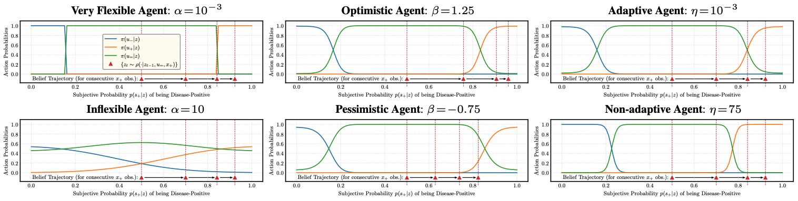
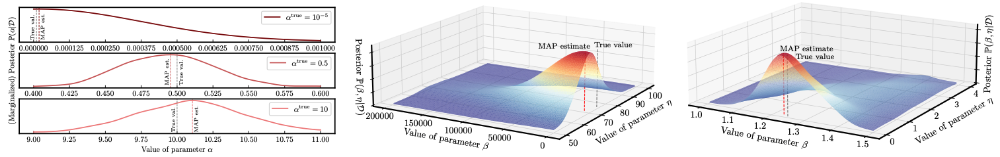

# [Inverse Bounded Rational Control](http://proceedings.mlr.press/v139/jarrett21a.html)

### Daniel Jarrett, Alihan H&uuml;y&uuml;k, Mihaela van der Schaar

#### International Conference on Machine Learning (ICML) 2021

Code Author: Alihan H&uuml;y&uuml;k (ah2075@cam.ac.uk)

### Overview

This repository contains the necessary code to replicate the main experimental results in the ICML 2021 paper "[Inverse Decision Modeling: Learning Interpretable Representations of Behavior](http://proceedings.mlr.press/v139/jarrett21a.html)." *Inverse Bounded Rational Control*, which is given as an example instance of inverse decision modeling in the paper, is implemented in files `diag/main.py` and `adni/main.py` for the decision-making environments considered in the paper, namely DIAG and ADNI.



### Usage

First, install the required python packages by running:

```
python3 -m pip install -r requirements.txt
```

For generating the figures, make sure you have Latex installed

```
sudo apt install texlive texlive-latex-extra texlive-fonts-recommended dvipng cm-super
```

Then, the main experimental results in the paper can be replicated by running:

```
./diag/run.sh
python3 diag/plot-forward.py  # generates Figure 2
python3 diag/plot-inverse.py  # generates Figure 3
python3 diag/eval-irl.py      # computes cost-benefit ratios in Section 5.2

./adni/run.sh
python3 adni/eval.py          # computes estimated values of beta in Section 5.3
```

Note that, in order to run the experiments for ADNI, you need to get access to the [Alzheimer's Disease Neuroimaging Initiative (ADNI)](http://adni.loni.usc.edu/) dataset.



### Dependencies

The following packages are needed for running the model:

- dill==0.3.2
- jax==0.2.8
- jaxlib==0.1.58
- matplotlib==3.3.0
- numpy==1.19.0
- pandas==1.0.5
- scipy==1.5.1

### Reference

If you use this code, please cite:

```
@article{jarrett2021inverse,
  title = {Inverse Decision Modeling: Learning Interpretable Representations of Behavior},
  author = {Jarrett, Daniel and H{\"u}y{\"u}k, Alihan and van der Schaar, Mihaela},
  journal = {International Conference on Machine Learning},
  year = {2021},
}
```